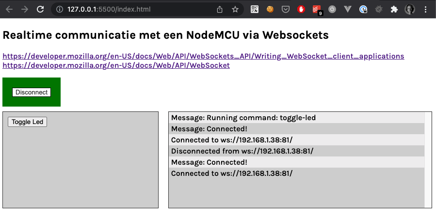
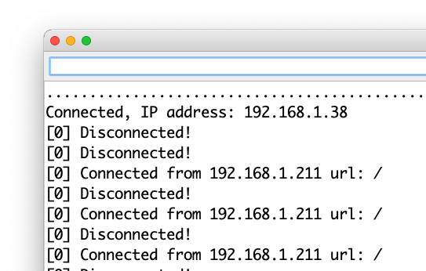

# NodeMCU + Websockets

Voorbeeld hoe je een webpagina via Websockets aan een NodeMCU / Arduino kunt verbinden.
De webpagina is de client. De NodeMCU start een Websocket server. Zo kun je over en weer berichten sturen.

## Libraries installeren

- Open de Arduino IDE
- Ga naar Schets > Bibliotheek gebruiken > Bibliotheek installeren
- Zoek en installeer de `Arduino_JSON` library
- Zoek en installeer de `Websockets` library (van Markus Sattler)

## Instructies

1. Vul de WIFI credentials in in `wifi_secrets.h`
2. Compileer en Upload de sketch naar je NodeMCU
3. Kijk in de Serial monitor wat het IP adres is van de NodeMCU
4. Pas de URL aan met het juiste IP adres in `script.js`
5. Start `index.html` met de live server
6. KLik op connect (kijk in console voor extra logs)
7. Klik op Toggle Led (er wordt een JSON string gestuurd naar de NodeMCU)
8. De NodeMCU leest het commando en voert een stukje code uit die ingebouwde de Led aan/uit zet.

### Web pagina

### Arduino Serial monitor

### Resultaat

